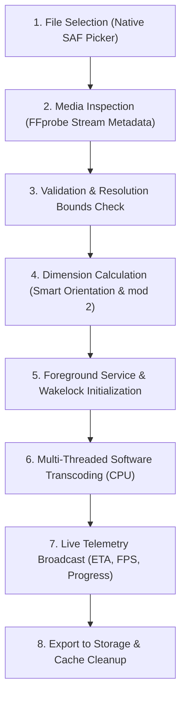

# Phantek Video Toolkit

<p align="center">
  
</p>

<div align="center">
  
  
  <a href="https://github.com/zerabyte88/video_downscaler/releases"></a>
  
</div>

<br/>

**Phantek Video Toolkit** is an offline, on-device mobile video transcoding, downscaling, and format conversion application built with Flutter and FFmpeg (`ffmpeg_kit_flutter_new`). The application compresses high-bitrate and high-resolution videos (such as 4K and 2K) to standardized formats (1080p, 720p, 480p, 360p, 240p) directly on the device without requiring network access or external server infrastructure.

---

## Core Architecture and Design Decisions

### 1. Pure Software Pipeline (Zero Hardware Acceleration)
To guarantee deterministic encoding output across diverse Android chipsets (Snapdragon, MediaTek, Exynos, Tensor, Unisoc), all hardware-accelerated encoders and decoders (e.g., `mediacodec`) have been excluded from the transcoding pipeline:
- **Software Decoding:** Input streams are parsed and decoded entirely through standard FFmpeg CPU demuxers and decoders.
- **Software Encoding:** Encoders are strictly locked to `libx264` (H.264), `libx265` (H.265 / HEVC), and `libvpx-vp9` (VP9).
- **Stability and Color Accuracy:** Eliminates vendor-specific driver fragmentation, green/red/yellow tint glitches, macroblocking artifacts, and abrupt process termination commonly associated with proprietary Android MediaCodec wrappers.

### 2. Unified Pixel Format and Filtergraph Pipeline
All scaling, rotation handling, and color normalization operations execute inside an atomic FFmpeg filtergraph:
- **Filter Syntax:** `-vf "fps=fps=<FPS>,scale=<W>:<H>:flags=lanczos,format=yuv420p"`
- **Even Dimension Alignment:** Target widths and heights are strictly calculated to even numbers (`mod 2`) to meet macroblock boundary constraints.
- **Universal Chroma Subsampling:** Enforces 8-bit `yuv420p` within the filter chain, ensuring full compatibility with default Android system players, Google Photos, WhatsApp, and third-party media players.

### 3. Background Persistence and Screen-Off Operation
Video transcoding requires sustained CPU utilization over extended durations. The application implements background persistence protocols compliant with Android 13, 14, and 15:
- **Android Foreground Service:** Operates with the `mediaProcessing` foreground service type (`flutter_foreground_task`), displaying live conversion progress in the notification tray.
- **Alert Once Notification Protocol:** Foreground notification pop-up (*heads-up banner*) triggers strictly once at task start and upon completion. Progress telemetry updates silently in the status bar tray without interrupting the user.
- **CPU Wakelock:** Employs `wakelock_plus` to hold partial CPU execution locks during encoding, preventing the Android OS from suspending the process when the screen turns off.
- **Automated Resource Management:** Services and wakelocks are released immediately upon process completion, cancellation, or failure.

---

## Key Features

### Refined Human-Crafted User Interface (Material 3)
- **Modern Clean Design:** Completely overhauled UI free of generic AI-generated aesthetics (no neon gradients, no clashing rainbow icons, and no oversized glowing cards).
- **Native Segmented Control:** Intuitive toggle between Downscale, Upscale, and Convert modes via native segmented controls.
- **Elegant Drop / Import Zone:** Streamlined video selection experience with responsive layout and clear specification tags.
- **Seamless Return-to-Home Flow:** Success sheet includes a single-tap "Kembali ke Beranda" (Return to Home) button that cleanly resets the session, ready for subsequent tasks.
- **Theme Modes:** AMOLED Pitch Black, Slate Midnight Dark, and Clean Light mode with full semantic color tokens.

### Video Scaling and Codec Management
- **Resolution Downscaling & Upscaling:** Supports target presets for 1080p, 720p, 480p, 360p, and 240p. Automatic checks prevent accidental operations outside bounds.
- **Smart Aspect Ratio and Orientation Engine:** Reads stream orientation and rotation metadata (90°, 180°, 270°) to preserve portrait and landscape aspects without stretching or black bar distortion.
- **Mode-Locked Codec Stability:**
  - **Downscale & Upscale Modes:** Exclusively locked to standard **H.264 (`libx264`)** with WebM filtered out, ensuring 100% stable outputs playable by all default Android gallery/video players without user configuration errors.
  - **Convert Mode:** Unlocks advanced codecs (**H.265 / HEVC**, **VP9**, **H.264**) and containers (**MP4**, **MKV**, **MOV**, **WebM**) for power users, accompanied by in-app compatibility warnings advising that HEVC/VP9 may require modern media players (e.g., VLC, MX Player) on devices lacking native hardware decoders.
- **Codec Specifications:**
  - **H.264 / AVC (`libx264`):** Standard profile configuration (`-profile:v high -level:v 4.1`) for maximum device compatibility.
  - **H.265 / HEVC (`libx265`):** High-efficiency video coding with automatic `-tag:v hvc1` injection for MP4 and MOV containers.
  - **VP9 (`libvpx-vp9`):** Open-source profile with optimized threading (`-deadline good -cpu-used 4 -row-mt 1 -tile-columns 2`) paired with `libopus` audio in WebM and MKV containers.
- **Container Support:** MP4 (with `-movflags +faststart`), MKV, MOV, and WebM.

### Storage and Output Management
- **Custom Output Folder Selection:** Select any local storage directory via Settings (`FilePicker.getDirectoryPath`), with an instant "Reset to Movies" option.
- **Safe Fallback Defaults:** Automatically defaults to `/storage/emulated/0/Movies` directly on Android without nested subfolders.
- **Non-Destructive Output Naming:** Automatically detects filename collisions and appends incremental identifiers (`video-1080p-2.mp4`) to avoid overwriting existing media.
- **Automated Cache Purge:** Clears temporary cached input streams originating from the native Android file picker to prevent storage bloat.

### Process Telemetry and Error Transparency
- **Real-Time Monitoring:** Live progress calculation reporting encoding speed (fps), elapsed time, calculated remaining time (ETA), and estimated output size.
- **Detailed Error Diagnostics:** Captures stderr logs directly from the FFmpeg session with interactive inspection modals.

### Multi-Language Localization
Full native string translations with 100% parity across 6 languages:
- 🇮🇩 Bahasa Indonesia
- 🇬🇧 English
- 🇯🇵 日本語 (Japanese)
- 🇨🇳 简体中文 (Simplified Chinese)
- 🇹🇼 繁體中文 (Traditional Chinese)
- 🇰🇷 한국어 (Korean)

---

## Pipeline Execution Flow



### Pipeline Overview

| Step | Component | Technical Operation |
| :---: | :--- | :--- |
| **01** | Input Handler | Retrieves content URI via Storage Access Framework and resolves absolute path. |
| **02** | Metadata Probe | Inspects video stream: codec, dimensions, bitrate, rotation tags, audio channels. |
| **03** | Configuration | Validates downscale constraints and applies CRF or target bitrate parameters. |
| **04** | Filter Synthesis | Constructs `-vf "scale=W:H:flags=lanczos,format=yuv420p"` with even dimensions. |
| **05** | Service Lifecycle | Binds Android foreground service with notification channel and holds CPU wakelock. |
| **06** | FFmpeg Execution | Executes multi-threaded software encoder using configured CPU preset and threads. |
| **07** | Telemetry Stream | Computes progress, speed multiplier, elapsed duration, and remaining ETA. |
| **08** | Finalization | Writes output to Movies directory, registers MediaStore entry, and releases wakelocks. |

---

## Build and Compilation

Phantek Video Toolkit utilizes native C/C++ shared libraries bundled through `ffmpeg_kit_flutter_new`. To optimize binary size and memory efficiency on modern smartphones, the application is built exclusively for 64-bit ARM (`arm64-v8a`) architectures, completely deprecating legacy 32-bit packages.

### Local Build Commands

```bash
# Build lightweight release APK for 64-bit ARM devices
flutter build apk --release --split-per-abi --target-platform android-arm64
```

Compiled APK will be located in:
`build/app/outputs/flutter-apk/`
- `Phantek-Video-Toolkit-arm64-v8a-v1.1.2.apk` (64-bit ARM)

### Automated CI/CD Workflow
The repository contains a GitHub Actions workflow (`.github/workflows/build-apk.yml`) that triggers on release tags (e.g. `v1.1.2`) or manual workflow dispatch:
- Configured without conflicting `ndk.abiFilters` and `splits.abi` for seamless AGP builds.
- Builds optimized 64-bit ARM APK.
- Packages and publishes binary assets directly to GitHub Releases.

---

## Release History

### v1.1.2 (Build 12)
- **Background Persistence:** Integrated Android Foreground Service (`mediaProcessing` & `dataSync`) with silent progress updates in notification tray, avoiding throttling or pausing when minimized.
- **Sleep & Screen-Off Execution:** Holds CPU wakelock (`wakelock_plus`) and prompts for battery optimization whitelist to keep transcoding alive when device screen is turned off.
- **Mode-Locked Codec Safety:** Downscale and Upscale modes strictly default to standard H.264 (`libx264`) + MP4/MKV to prevent native gallery playback failures; Convert mode retains full access to H.265 (HEVC) and VP9 with compatibility warnings.
- **Custom Output Folder:** Configurable save location in Settings (`FilePicker.getDirectoryPath`) with standard `Movies` fallback.
- **Return to Home UX:** Dedicated button on completion sheet immediately resets input state for subsequent video processing.
- **Full Localization Parity:** 100% string coverage across 6 supported languages (ID, EN, JA, ZH-CN, ZH-TW, KO).

### v1.1.1 (Build 11)
- **CI/CD Stabilization:** Fixed Android Gradle Plugin ABI packaging conflicts in `.github/workflows/build-apk.yml`.
- **UI Label Cleanup:** Streamlined resolution labels to cleaner formatting (`Original (720p)` instead of redundant brackets).
- **Multi-language Alignment:** Resolved language leaking issues ensuring all screens respect the active locale.

---

## License

This software is distributed under the terms of the GNU General Public License v3.0 (GPLv3) to comply with dependencies bundled within `ffmpeg_kit_flutter_new` and the `libx264` GPL licensing requirements.
