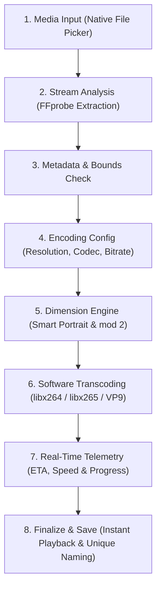

# Phantek Video Toolkit

<p align="center">
  
</p>

<div align="center">
  
  
  
  
</div>

<br/>

**Phantek Video Toolkit** is an on-device video compression and resolution scaling application built with Flutter and FFmpeg. It is designed to compress large high-resolution videos (such as 4K and 2K) into optimized standard formats (1080p, 720p, etc.) locally on the device without requiring internet connectivity.

---

## Key Features

### Intelligent Downscaling & Codec Support
- **Resolution Downgrading:** Downscale 4K or 2K videos to 1080p, 720p, 480p, 360p, or 240p. Includes safety checks to prevent upscaling of low-resolution videos.
- **Smart Portrait Detection:** Detects portrait/vertical videos via rotation metadata and adjusts target scaling dynamically (e.g., outputs `1080x1920` instead of `1920x1080`), ensuring aspect ratio and orientation are preserved accurately.
- **Advanced Video Codecs:** 
  - **H.264 / AVC:** Broad compatibility across media players and devices.
  - **H.265 / HEVC:** High compression efficiency. Automatically injects the `-tag:v hvc1` tag for MP4/MOV formats to improve compatibility.
  - **VP9:** High compression efficiency. Container format is restricted to WebM and MKV to ensure compatibility with native Android playback.
- **Target Container Formats:** Support for MP4, MKV, MOV, and WebM encoding.

### High-Stability Software Transcoding
- **Multi-Threaded CPU Optimization:** Utilizes multi-threaded software encoders (`libx264`, `libx265`, `libvpx-vp9`) with configurable thread counts and CPU presets.
- **Universal Stability:** Ensures consistent export stability and video fidelity across various Android chipsets by relying on software encoding, bypassing potential hardware encoder fragmentation.
- **Auto-Collision File Numbering:** Automatically appends an incremental number (e.g., `video4k-1080p-2.mp4`) to the output filename if a file with the same name already exists, preventing accidental overwrites.

### Real-Time Telemetry & UX
- **Live Processing Dashboard:** Displays estimated time of arrival (ETA), processing speed (FPS), estimated output size, and completion percentage.
- **Wakelock & Background Persistence:** Utilizes `flutter_foreground_task` to ensure transcoding continues reliably when the application is minimized or the device screen is off.
- **Multi-Language Support (6 Languages):** Support for Bahasa Indonesia, English, 日本語, 简体中文, 繁體中文, and 한국어.
- **Adaptive UI:** Includes AMOLED Dark, Standard Dark, and Light themes.

---

## Architecture & FFmpeg Pipeline



### Pipeline Stages Breakdown

| Stage | Process | Key Responsibility |
| :---: | :--- | :--- |
| **01** | **Media Input** | Streams selected video from device storage via native Android SAF. |
| **02** | **FFprobe Probe** | Extracts metadata: container format, stream specifications, rotation angle, framerate, and audio channels. |
| **03** | **Validation** | Determines eligible downscale targets and prevents upscaling. |
| **04** | **Configuration** | Configures user-selected codec, container, and CRF or target bitrate. |
| **05** | **Dimension Engine** | Adjusts dimensions for portrait videos and enforces `mod 2` alignment. |
| **06** | **Transcoding** | Employs multi-threaded software encoding for consistent stability. |
| **07** | **Live Telemetry** | Calculates elapsed duration, remaining ETA, processing FPS, and live file size. |
| **08** | **Finalization** | Saves output to device Movies folder with automatic collision numbering, cleans cache, and provides playback. |

### FFmpeg Command Logic

The app optimizes FFmpeg arguments for mobile hardware:
- **Scaling:** Uses `-vf "scale=<W>:<H>:flags=lanczos,format=yuv420p"` enforcing `mod 2` scaling for hardware decoding compatibility.
- **VP9 Optimization:** Uses `-deadline good -cpu-used 4 -row-mt 1` to improve VP9 encoding speeds compared to default settings.
- **Faststart:** Applies `-movflags +faststart` to MP4 and MOV files for optimized web streaming.

---

## Building the APK (Automated & Optimized)

> [!TIP]  
> Phantek Video Toolkit utilizes the `ffmpeg_kit_flutter_new` architecture. To maintain compact application sizes, we build and release Split ABI APKs for ARM 32-bit (`armeabi-v7a`) and ARM 64-bit (`arm64-v8a`). The Universal Fat APK is excluded from the build pipeline.

### Method 1: Local Build
```bash
# Build architecture-specific APKs:
flutter build apk --release --split-per-abi --target-platform android-arm,android-arm64
```
Outputs are routed to `build/app/outputs/flutter-apk/`.

### Method 2: GitHub Actions CI/CD
This repository includes a `.github/workflows/build-apk.yml` workflow.
- **Automated Version Tagging:** The workflow reads `pubspec.yaml` (e.g., `1.0.8+8`) and renames the output APKs (e.g., `Phantek-Video-Toolkit-arm64-v8a-v1.0.8.apk`), automating the release naming process.
- **Triggering Releases:** Push a new version tag (`git tag v1.0.8 && git push origin v1.0.8`) or run the workflow manually to compile and publish split APKs to GitHub Releases.

---

## License

This project is licensed under the terms of the GNU General Public License v3.0 (GPLv3) to comply with the bundled `ffmpeg_kit_flutter_new` package and `libx264` codec requirements.
