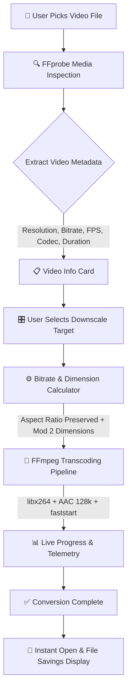

# 🎬 HS Video Converter

<p align="center">
  
</p>

<p align="center">
  
  
  
  
  
</p>

<p align="center">
  <strong>A modern, offline mobile application to downscale and compress high-resolution videos directly on your Android device.</strong>
</p>

<p align="center">
  <em>Preserve storage space and compress 4K / 2K videos into shareable HD formats without uploading private files to third-party cloud servers.</em>
</p>

---

## 📖 Overview

Modern smartphones record stunning 4K and 2K videos, but these files are often hundreds of megabytes or even gigabytes in size. Sharing them over messaging platforms (like WhatsApp, Discord, or Telegram) or via email frequently fails due to strict file-size limits.

Furthermore, many smartphones—especially **mid-range and budget (low-end) devices**—lack the dedicated hardware decoders, CPU/GPU throughput, or memory bandwidth required to decode and smoothly play ultra-high-resolution 2K and 4K media. When attempting to open these heavy files, users often experience severe frame stuttering, audio/video desynchronization, app freezing, or outright "Cannot play video" errors. Solving this playback bottleneck and making videos universally accessible across all devices is one of the primary reasons **HS Video Converter** was created.

**HS Video Converter** is an open-source Flutter mobile utility powered by the full GPL build of **FFmpeg** (`ffmpeg_kit_flutter_full_gpl`). It runs **100% locally on your device**, performing hardware-accelerated and software transcoding without requiring an internet connection. Your videos never leave your phone, guaranteeing absolute privacy and zero mobile data consumption.

---

## ✨ Key Features

- **🔒 100% Offline & Private Processing**
  - No cloud uploads, no external APIs, and no telemetry. All FFprobe media inspection and FFmpeg transcoding occur locally on the device storage.

- **🎯 Intelligent Downscale Targets**
  - Automatically analyzes input media and exposes only valid downscaling target resolutions (e.g., 4K $\rightarrow$ 1080p, 720p, 480p, or 360p).
  - Prevents accidental upscaling that would degrade video quality and waste processing cycles.

- **📐 Aspect Ratio & Dimension Guard**
  - Automatically calculates target dimensions while strictly preserving original aspect ratios (16:9, 9:16 portrait, 4:3, 1:1, etc.).
  - Enforces even-dimension constraints (`mod 2`) required by the H.264 (`libx264`) video encoder.

- **⚡ Proportional Bitrate Calculation**
  - Dynamically calculates target bitrate based on pixel reduction ratio, clamped within optimal quality bounds:
    - **1080p (FHD):** 4.0 – 12.0 Mbps
    - **720p (HD):** 2.0 – 6.0 Mbps
    - **480p (SD):** 1.0 – 3.0 Mbps
    - **360p:** 0.5 – 2.0 Mbps
  - Preserves audio quality using AAC stereo encoding at 128 kbps with `+faststart` MP4 container flags for instant streaming playback.

- **📊 Real-time Transcoding Telemetry & Time Estimator**
  - Live radial progress indicator with percentage readout.
  - **Live Elapsed Timer**: Shows exact duration since conversion began (`01:24`).
  - **Dynamic Estimated Remaining Time (ETA)**: Continuously projects completion time (`~02:10`).
  - **Total Processing Duration**: Displays overall completion time upon finishing (`Finished in 02:15`).
  - Real-time statistics: encoding speed multiplier (e.g. `1.8x` real-time) and accumulated output file size.
  - Safe, responsive cancellation to interrupt long-running transcoding tasks at any moment.

- **💾 File Management & Direct Launch**
  - Stores output in an organized `HS Video Converter` (`HSVideoConverter`) application folder.
  - Calculates and displays exact file size savings (e.g. *"Saved 72%"*).
  - Open output videos directly in your favorite video player with a single tap via `open_file`.

- **⏳ Instant Loading Feedback & File Analysis**
  - Instantaneous loading screen activated the moment a video is selected.
  - Reassures the user during heavy file copying/caching and FFprobe metadata analysis with pulsating animations and status messages.

- **🎛️ Comprehensive Encoding Options (Resolution, Bitrate, Format & Codec)**
  - **Resolution**: Original resolution preservation or smart downscale targets (1080p, 720p, 480p, 360p).
  - **Bitrate**: Auto (intelligently computed), High Quality, Balanced, Low Size, or Custom Slider (1–30 Mbps).
  - **Container Format**: MP4, MKV, MOV, and WebM.
  - **Video Codec**: H.264 / AVC (`libx264`), H.265 / HEVC (`libx265`), VP9 (`libvpx-vp9`), and MPEG-4 (`mpeg4`).

- **🌐 Multi-Language Support (6 Languages)**
  - Seamless in-app switching between **Bahasa Indonesia**, **English**, **日本語 (Japanese)**, **简体中文 (Simplified Chinese - China)**, **繁體中文 (Traditional Chinese - Taiwan)**, and **한국어 (Korean)**.

- **⚙️ Deep Hardware & Performance Tuning**
  - **Display Themes**: Choose between **Standard Dark Mode**, **Dark OLED Mode** (True `#000000` pitch black for maximum AMOLED battery savings), and **Light Mode**.
  - **Keep Screen Awake (Wakelock)**: Prevents the display from turning off or sleeping during encoding tasks (includes clear battery consumption warning).
  - **CPU Core / Thread Control**: Specify thread count (`-threads N`) or Auto to balance conversion speed vs. battery & device temperature.
  - **RAM & Memory Buffer Allocation**: Choose from 256 MB (Low Memory), 512 MB (Balanced), 1024 MB (High Performance), or 2048 MB (Maximum) to prevent out-of-memory crashes on resource-constrained devices.
  - **CPU Preset**: Tune encoding speed vs. compression ratio (`ultrafast`, `superfast`, `veryfast`, `fast`, `medium`, `slow`).
  - **Hardware Acceleration**: Optional Android MediaCodec acceleration for energy-efficient GPU transcoding.
  - **Audio Bitrate Control**: Customize audio quality (64 kbps, 128 kbps, 192 kbps, 256 kbps) or strip audio completely (Mute).

- **🎨 Multi-Theme UI (Dark, OLED, Light)**
  - Built with Flutter Material 3 supporting sleek Dark (`#11111B`), Pure OLED Black (`#000000`), and Clean Light (`#F6F7FB`) modes.
  - Clean typographic hierarchy and animated progress indicators.

---

## 🛠️ Architecture & How It Works



### FFmpeg Transcoding Command Breakdown

The application executes an optimized FFmpeg command configured for mobile efficiency and compatibility:

```bash
ffmpeg -i "<input_path>" \
  -vf "scale=<target_width>:<target_height>" \
  -c:v libx264 \
  -preset medium \
  -b:v <computed_bitrate>k \
  -c:a aac \
  -b:a 128k \
  -movflags +faststart \
  -y "<output_path>"
```

- `-vf "scale=..."`: Scales video to even dimensions while keeping original aspect ratio.
- `-c:v libx264 -preset medium`: Balance of fast encoding and strong compression efficiency.
- `-c:a aac -b:a 128k`: High-fidelity stereo audio compression.
- `-movflags +faststart`: Moves the `moov` atom to the beginning of the MP4 container for instant playback.

---

## 🗂️ Project Structure

```
video_downscaler/
├── .github/
│   └── workflows/
│       └── build-apk.yml          # GitHub Actions CI/CD workflow for automated APK builds
├── android/
│   ├── app/
│   │   ├── build.gradle.kts       # Android app build configuration (minSdk 24, Java 17)
│   │   └── src/main/
│   │       └── AndroidManifest.xml # Storage & media permissions
│   └── build.gradle.kts           # Root gradle configuration
├── lib/
│   ├── main.dart                  # Application entry point & theme initialization
│   ├── models/
│   │   └── video_info.dart        # Video metadata models & resolution presets
│   ├── screens/
│   │   ├── home_screen.dart       # Main dashboard: file picker & resolution selection
│   │   └── processing_screen.dart # Real-time transcoding progress, cancel, & results
│   ├── services/
│   │   └── ffmpeg_service.dart    # FFprobe info extractor & FFmpeg transcoding engine
│   ├── theme/
│   │   └── app_theme.dart         # Material 3 dark theme definitions
│   └── widgets/
│       ├── resolution_selector.dart # Interactive resolution options with quality badges
│       └── video_info_card.dart     # Formatted media details grid
├── test/
│   └── widget_test.dart           # UI & widget tests
└── pubspec.yaml                   # Dependencies & package configuration
```

---

## 📦 Tech Stack & Dependencies

| Package | Version | Purpose |
|:---|:---|:---|
| **[Flutter SDK](https://flutter.dev)** | `^3.47.0` | Cross-platform UI toolkit |
| **[ffmpeg_kit_flutter_full_gpl](https://pub.dev/packages/ffmpeg_kit_flutter_full_gpl)** | `^6.0.3` | Full FFmpeg + FFprobe engine with GPL codecs (libx264) |
| **[file_picker](https://pub.dev/packages/file_picker)** | `^13.1.0` | Native file picker for selecting device video files |
| **[video_player](https://pub.dev/packages/video_player)** | `^2.14.0` | Video playback backend support |
| **[path_provider](https://pub.dev/packages/path_provider)** | `^2.1.6` | Accessing standard Android document storage paths |
| **[open_file](https://pub.dev/packages/open_file)** | `^4.0.0` | Launching output videos via default Android media player |
| **[intl](https://pub.dev/packages/intl)** | `^0.20.3` | Formatting utilities |

---

## 🚀 Getting Started

### Prerequisites

Ensure your development environment meets the following requirements:
- **Flutter SDK**: `3.13.0` or higher (tested on `3.47.4`)
- **Dart SDK**: `^3.13.3`
- **JDK**: Java 17 (Temurin recommended)
- **Android SDK**: `minSdkVersion 24` (Android 7.0 Nougat) or higher

### Local Installation

1. **Clone the repository:**
   ```bash
   git clone https://github.com/zerabyte88/video_downscaler.git
   cd video_downscaler
   ```

2. **Install dependencies:**
   ```bash
   flutter pub get
   ```

3. **Verify analyzer and tests:**
   ```bash
   flutter analyze
   flutter test
   ```

4. **Run the application:**
   Connect an Android device with USB debugging enabled, then execute:
   ```bash
   flutter run
   ```

---

## 📱 Building the APK

### Method 1: Local Build

To build release APKs locally on your machine:

```bash
# Build universal release APK (contains all ABIs)
flutter build apk --release

# OR build architecture-specific APKs (smaller download size per device):
flutter build apk --release --split-per-abi
```

The compiled APKs will be located at:
`build/app/outputs/flutter-apk/`
- `app-release.apk` (Universal)
- `app-arm64-v8a-release.apk` (Modern 64-bit devices, recommended)
- `app-armeabi-v7a-release.apk` (Older 32-bit devices)
- `app-x86_64-release.apk` (Emulators)

---

### Method 2: Automated CI/CD via GitHub Actions 🤖

This repository includes a fully configured automated GitHub Actions workflow [`.github/workflows/build-apk.yml`](.github/workflows/build-apk.yml).

#### How the GitHub Automation Works:

1. **Automatic Build on Push & PR:**
   - Every push to `main` and pull request automatically triggers Flutter static analysis (`flutter analyze`), unit/widget tests (`flutter test`), and builds the release APK.
   - You can download the generated APK directly from the **Actions** tab $\rightarrow$ select the workflow run $\rightarrow$ scroll to **Artifacts** $\rightarrow$ download `video-downscaler-apk`.

2. **Manual Build (Workflow Dispatch):**
   - Navigate to the **Actions** tab on your GitHub repository.
   - Select **Build Android APK** from the left sidebar.
   - Click **Run workflow** and choose your branch. You can toggle whether to generate split-per-ABI APKs.

3. **Automated GitHub Releases (Git Tag):**
   - Push a version tag (e.g. `v1.0.0`) to trigger an automated release:
     ```bash
     git tag v1.0.0
     git push origin v1.0.0
     ```
   - GitHub Actions will build the release APKs, automatically draft a GitHub Release with auto-generated release notes, and attach the APK files for public download.

---

## 📄 License & Attribution

This project is licensed under the terms of the GNU General Public License v3.0 (GPLv3) to comply with the bundled `ffmpeg_kit_flutter_full_gpl` package and `libx264` codec requirements.