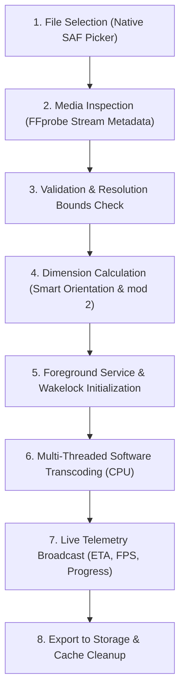

# Phantek - Video Toolkit

<p align="center">
  
</p>

<div align="center">
  
  
  <a href="https://github.com/zerabyte88/phantek-video-toolkit/releases"></a>
  <a href="LICENSE"></a>
</div>

<br/>

**Phantek** (Phantek - Video Toolkit) is an offline, on-device mobile video transcoding, downscaling, format conversion, and audio extraction application built with Flutter and FFmpeg (`ffmpeg_kit_flutter_new`). The application compresses high-bitrate and high-resolution videos (such as 4K and 2K) to standardized formats (1080p, 720p, 480p, 360p, 240p) and extracts audio tracks directly on the device without requiring network access or external server infrastructure.

---

## Core Architecture and Design Decisions

### 1. Pure Software Pipeline (Zero Hardware Acceleration)
To guarantee deterministic encoding output across diverse Android chipsets (Snapdragon, MediaTek, Exynos, Tensor, Unisoc), all hardware-accelerated encoders and decoders (e.g., `mediacodec`) have been excluded from the transcoding pipeline:
- **Software Decoding:** Input streams are parsed and decoded entirely through standard FFmpeg CPU demuxers and decoders.
- **Software Encoding:** Encoders are strictly locked to `libx264` (H.264) and `libx265` (H.265 / HEVC).
- **Stability and Color Accuracy:** Eliminates vendor-specific driver fragmentation, green/red/yellow tint glitches, macroblocking artifacts, and abrupt process termination commonly associated with proprietary Android MediaCodec wrappers.

### 2. Unified Pixel Format and Filtergraph Pipeline
All scaling, rotation handling, and color normalization operations execute inside an atomic FFmpeg filtergraph:
- **Filter Syntax:** `-vf "fps=fps=<FPS>,scale=<W>:<H>:flags=lanczos,format=yuv420p"`
- **Even Dimension Alignment:** Target widths and heights are strictly calculated to even numbers (`mod 2`) to meet macroblock boundary constraints.
- **Universal Chroma Subsampling:** Enforces 8-bit `yuv420p` within the filter chain, ensuring full compatibility with default Android system players, Google Photos, WhatsApp, and third-party media players.

### 3. Background Persistence and Screen-Off Operation
Video transcoding requires sustained CPU utilization over extended durations. The application implements background persistence protocols compliant with Android 13, 14, and 15:
- **Android Foreground Service:** Operates with the `mediaProcessing` foreground service type (`flutter_foreground_task`), displaying live conversion progress in the notification tray.
- **Alert Once Notification Protocol:** Foreground notification pop-up (*heads-up banner*) triggers strictly once at task start and upon completion. Progress telemetry updates silently in the status bar tray without interrupting the user.
- **CPU Wakelock:** Employs `wakelock_plus` to hold partial CPU execution locks during encoding, preventing the Android OS from suspending the process when the screen turns off.
- **Automated Resource Management:** Services and wakelocks are released immediately upon process completion, cancellation, or failure.

---

## Key Features

### Refined Human-Crafted User Interface (Material 3)
- **Modern Clean Design:** Completely overhauled UI free of generic AI-generated aesthetics (no neon gradients, no clashing rainbow icons, and no oversized glowing cards).
- **Categorized Mode Selector:** Intuitive top selector bar grouped into dedicated media categories: **Video** (housing **Convert** and **Downscale**) and **Audio** (housing **Audio Extractor**), with proportional button sizing and dynamic active-category highlighting.
- **Dedicated Audio Extractor:** Directly strips audio tracks from video into high-quality **MP3** (`libmp3lame`), **M4A / AAC** (`aac`), or uncompressed studio lossless **WAV** (`pcm_s16le`) with optional ultra-fast stream copy or customizable bitrate.
- **Elegant Drop / Import Zone:** Streamlined video selection experience with responsive layout and clear specification tags.
- **Seamless Return-to-Home Flow:** Success sheet includes a single-tap "Return to Home" button that cleanly resets the session, ready for subsequent tasks.
- **Theme Modes:** AMOLED Pitch Black, Slate Midnight Dark, and Clean Light mode with full semantic color tokens.

### Video Scaling and Codec Management
- **Resolution Downscaling:** Supports target presets for 1080p, 720p, 480p, 360p, and 240p. Automatic checks prevent accidental operations outside bounds.
- **Smart Aspect Ratio and Orientation Engine:** Reads stream orientation and rotation metadata (90°, 180°, 270°) to preserve portrait and landscape aspects without stretching or black bar distortion.
- **Mode-Locked Codec Stability:**
  - **Downscale Mode:** Exclusively locked to standard **H.264 (`libx264`)**, ensuring 100% stable outputs playable by all default Android gallery/video players without user configuration errors.
  - **Convert Mode:** Unlocks **H.265 / HEVC** and **H.264** across **MP4**, **MKV**, and **MOV** containers for power users, accompanied by in-app compatibility warnings advising that HEVC may require modern media players (e.g., VLC, MX Player) on devices lacking native hardware decoders.
- **Codec Specifications:**
  - **H.264 / AVC (`libx264`):** Standard profile configuration (`-profile:v high -level:v 4.1`) for maximum device compatibility.
  - **H.265 / HEVC (`libx265`):** High-efficiency video coding with automatic `-tag:v hvc1` injection for MP4 and MOV containers.
- **Container Support:** MP4 (with `-movflags +faststart`), MKV, and MOV.

### Storage and Output Management
- **Custom Output Folder Selection:** Select any local storage directory via Settings (`FilePicker.getDirectoryPath`), with an instant "Reset to Movies" option.
- **Safe Fallback Defaults:** Automatically defaults to `/storage/emulated/0/Movies` directly on Android without nested subfolders.
- **Non-Destructive Output Naming:** Automatically detects filename collisions and appends incremental identifiers (`video-1080p-2.mp4`) to avoid overwriting existing media.
- **Automated Cache Purge:** Clears temporary cached input streams originating from the native Android file picker to prevent storage bloat.

### Process Telemetry and Error Transparency
- **Real-Time Monitoring:** Live progress calculation reporting encoding speed (fps), elapsed time, calculated remaining time (ETA), and estimated output size.
- **Detailed Error Diagnostics:** Captures stderr logs directly from the FFmpeg session with interactive inspection modals.

### Multi-Language Localization
Full native string translations with 100% parity across 6 languages:
- 🇮🇩 Bahasa Indonesia
- 🇬🇧 English
- 🇯🇵 日本語 (Japanese)
- 🇨🇳 简体中文 (Simplified Chinese)
- 🇹🇼 繁體中文 (Traditional Chinese)
- 🇰🇷 한국어 (Korean)

---

## Pipeline Execution Flow



### Pipeline Overview

| Step | Component | Technical Operation |
| :---: | :--- | :--- |
| **01** | Input Handler | Retrieves content URI via Storage Access Framework and resolves absolute path. |
| **02** | Metadata Probe | Inspects video stream: codec, dimensions, bitrate, rotation tags, audio channels. |
| **03** | Configuration | Validates downscale constraints and applies CRF or target bitrate parameters. |
| **04** | Filter Synthesis | Constructs `-vf "scale=W:H:flags=lanczos,format=yuv420p"` with even dimensions. |
| **05** | Service Lifecycle | Binds Android foreground service with notification channel and holds CPU wakelock. |
| **06** | FFmpeg Execution | Executes multi-threaded software encoder using configured CPU preset and threads. |
| **07** | Telemetry Stream | Computes progress, speed multiplier, elapsed duration, and remaining ETA. |
| **08** | Finalization | Writes output to Movies directory, registers MediaStore entry, and releases wakelocks. |

---

## Build and Compilation

Phantek utilizes native C/C++ shared libraries bundled through `ffmpeg_kit_flutter_new`. To optimize binary size and memory efficiency on modern smartphones, the application is built exclusively for 64-bit ARM (`arm64-v8a`) architectures, completely deprecating legacy 32-bit packages.

### Local Build Commands

```bash
# Build lightweight release APK for 64-bit ARM devices
flutter build apk --release --split-per-abi --target-platform android-arm64
```

Compiled APK will be located in:
`build/app/outputs/flutter-apk/`
- `Phantek-Video-Toolkit-arm64-v8a-v1.2.1.apk` (64-bit ARM)

### Automated CI/CD Workflow
The repository contains a GitHub Actions workflow (`.github/workflows/build-apk.yml`) that triggers on release tags (e.g. `v1.2.1`) or manual workflow dispatch:
- Configured without conflicting `ndk.abiFilters` and `splits.abi` for seamless AGP builds.
- Builds optimized 64-bit ARM APK.
- Packages and publishes binary assets directly to GitHub Releases.

---

## Release History

### v1.2.1 (Build 17)
- **VP9 & WebM Deprecation for Stability:** Completely removed the VP9 (`libvpx-vp9`) video codec and `.webm` container format across all application modules, encoding pipelines, and localizations due to frequent bugs and low adoption.
- **Enhanced Codec & Container Streamlining:** Standardized video encoding to pure, robust **H.264 (`libx264`)** and **H.265 / HEVC (`libx265`)** across **MP4**, **MKV**, and **MOV** containers with unified AAC audio encoding.

### v1.2.0 (Build 16)
- **Application ID & Namespace Modernization:** Standardized package identifier and Android namespace to `com.phantek.cygnus.albireo` across Gradle, Kotlin manifests, and directory trees for production deployment.
- **Refined CPU Encoding Preset UX:** Rewrote CPU preset descriptions in Settings to be clear, natural, and easy to understand without distracting punctuation.
- **Repository & Brand Alignment:** Fully updated project documentation, releases badges, and source links to point to the dedicated `phantek-video-toolkit` GitHub repository.

### v1.1.5 (Build 15)
- **Unified & Illuminated Selection Styling:** Completely revamped all selectable chips, buttons, and tiles (Rate Control, Video Format, Video Codec, Target FPS, Audio Bitrates, CPU Presets, Core Allocations, RAM Buffers, Display Themes, and Language Selectors) with solid, high-contrast vibrant primary blue (`#2563EB`) fills, crisp pure-white typography (`#FFFFFF`), and unified accent borders. Replaced dark translucent tints and inconsistent badge colors for effortless visibility and unified visual harmony across AMOLED Black, Slate Dark, and Light themes.
- **320 kbps Studio Audio Quality:** Added a 320 kbps ultra-high bitrate audio encoding option across both the Audio Extractor module and global Settings Audio Quality configurations for maximum acoustic clarity.
- **Windows Task Manager-Style Live Telemetry Dashboard:** Integrated real-time conversion monitoring cards directly into the processing screen with live history line charts:
  - **Processor Workload (CPU Usage):** Live multi-threaded encoding workload percentage with active thread count and dynamic history wave.
  - **Memory Allocation (RAM RSS):** High-precision physical process resident memory read directly from Linux `/proc/self/status` (VmRSS) vs user-configured buffer limit with continuous line graph.
  - **Disk Write Throughput (Storage I/O):** Real-time disk write throughput measurement (in MB/s) tracking actual encoder output bytes with dynamic write velocity curves.
  - **Telemetry Stream Bug Fix:** Resolved a critical list initialization issue (`UnsupportedError: Cannot add to a fixed-length list`) and `CustomPaint.shouldRepaint` synchronization that caused telemetry metrics and graph visualizers to freeze during transcoding.
- **4096 MB (4GB) RAM Buffer with Hardware OOM Protection:** Added a 4096 MB buffer option in Settings for heavy workloads. To safeguard devices against OS Out-Of-Memory (OOM) kills, devices with $\le 4$ GB physical RAM automatically disable and grey out the 4GB chip with a descriptive hint.
- **Offline Developer Profile & Browser Intent Launch Fix:** Bundled an offline developer avatar asset in Settings and declared Android 11+ (API 30+) package visibility `<queries>` for HTTPS/HTTP schemes, ensuring developer profile and repository links open reliably in external browser apps.
- **Copyright-Safe Material 3 Telemetry Design:** Fully original visual design adhering to Phantek's Material 3 slate/cobalt aesthetics with soft-glow status indicators, auto-scaling value typography (`FittedBox`), and seamless contrast adaptation across AMOLED Black, Slate Dark, and Clean Light themes.
- **Full Localization Parity:** All telemetry labels, metrics, and new buffer hints are fully localized across all 6 supported languages (Indonesian, English, Japanese, Simplified Chinese, Traditional Chinese, Korean).

### v1.1.4 (Build 14)
- **Orientation-Agnostic Resolution Classification & Filtering:** Fixed downscale resolution logic for portrait/vertical smartphone videos (e.g. 1080x1920) by filtering against the shorter dimension (`shortDimension`). Portrait videos are accurately identified by their standard target category (e.g. 1080p instead of 2K) and downscale mode correctly hides higher targets like 1440p (2K) to eliminate unintended upscaling.
- **Silent Video Transcoding Safety:** Transcoding videos that do not contain an audio stream now automatically supplies the `-an` flag to FFmpeg, preventing encoder failures when attempting to encode non-existent audio tracks.
- **UI Overflow & Truncation Elimination:** Wrapped video and processing metadata value badges in responsive down-scaling widgets (`FittedBox`) to completely eliminate text truncation (e.g. `1920 × 10...` or labels getting cut off) on narrow smartphone screens and compact layouts.
- **Multi-Language Alignment & Zero Leakage:** Resolved untranslated strings in the processing screen audio summary and settings screen hardware specifications. Fully localized CPU thread units (`unit_core`), audio extraction cards (`audio_track`, `audio_extracted`), and default directories across all 6 supported languages (Indonesian, English, Japanese, Simplified Chinese, Traditional Chinese, Korean).
- **Comprehensive Hardware Specifications in Settings:** Redesigned device specifications card displaying human-readable Device Name (e.g. `Xiaomi 14T`), Model Code (e.g. `2406APNFAG`), Processor / SoC & Cores (e.g. `MediaTek Dimensity 8300 Ultra (8 Core)`), Graphics Processor / GPU (e.g. `Mali G615-MC6`), Marketed RAM (e.g. `12 GB`), and Internal Storage capacity with free space (e.g. `256 GB (142 GB Free)`), fully localized across all 6 supported languages.

### v1.1.3 (Build 13)
- **Audio Extractor Feature:** Added high-speed on-device audio extraction mode to extract tracks directly from video into **MP3** (`libmp3lame`), **M4A / AAC** (`aac`), or uncompressed studio lossless **WAV** (`pcm_s16le`) with ultra-fast stream copy or customizable bitrate.
- **Categorized Media Mode Bar:** Completely replaced Upscale with Audio Extractor. Reorganized the top mode selector into two dedicated category groups: **Video** (containing **Convert** and **Downscale**) and **Audio** (containing **Audio Extractor**) with adaptive responsive button sizing, dynamic active-group highlighting, and localized headers across all 6 languages.
- **CPU Preset Streamlining:** Removed the Slow preset in Settings, leaving 2 straightforward, practical options: **Fast** and **Normal** (balanced). Existing saved configurations automatically migrate.
- **Centered Settings Layout:** All interactive chips and button groups across Settings (CPU Cores, RAM Buffer, CPU Preset, Audio Quality, and Output Directory) are neatly center-aligned for optimal visual balance.
- **App Rebranding & Title:** Shortened app display name to **Phantek** with formal title **Phantek - Video Toolkit**.
- **AMOLED Dark Minimalist Logo:** Redesigned app launcher and assets to a modern 2D flat geometric emblem set on pure pitch-black AMOLED dark (`#000000`).
- **UI Layout & Navigation Polish:** Centered and streamlined option selector buttons (Target FPS, Video Format, Rate Control, Video Codec), added dedicated top-left back navigation, and separated top-right reset to strictly reset option choices without returning home.
- **Fiery Animated Title Badge:** Added a rotating fiery gradient border around the app title badge.
- **Author Attribution:** Added footer credits in Settings screen.
- **Multi-language Alignment:** Resolved text truncation on Japanese, Korean, and Chinese mode buttons using responsive scaling, normalized container label to "Video Format" across all 6 locales, and corrected Traditional Chinese terminology.

### v1.1.2 (Build 12)
- **Background Persistence:** Integrated Android Foreground Service (`mediaProcessing` & `dataSync`) with silent progress updates in notification tray, avoiding throttling or pausing when minimized.
- **Sleep & Screen-Off Execution:** Holds CPU wakelock (`wakelock_plus`) and prompts for battery optimization whitelist to keep transcoding alive when device screen is turned off.
- **Mode-Locked Codec Safety:** Downscale and Upscale modes strictly default to standard H.264 (`libx264`) + MP4/MKV to prevent native gallery playback failures; Convert mode retains full access to H.265 (HEVC) and VP9 with compatibility warnings.
- **Custom Output Folder:** Configurable save location in Settings (`FilePicker.getDirectoryPath`) with standard `Movies` fallback.
- **Return to Home UX:** Dedicated button on completion sheet immediately resets input state for subsequent video processing.
- **Full Localization Parity:** 100% string coverage across 6 supported languages (ID, EN, JA, ZH-CN, ZH-TW, KO).

### v1.1.1 (Build 11)
- **CI/CD Stabilization:** Fixed Android Gradle Plugin ABI packaging conflicts in `.github/workflows/build-apk.yml`.
- **UI Label Cleanup:** Streamlined resolution labels to cleaner formatting (`Original (720p)` instead of redundant brackets).
- **Multi-language Alignment:** Resolved language leaking issues ensuring all screens respect the active locale.

---

## License

This project is licensed under the **GNU General Public License v3.0 (GPLv3)**. See the [LICENSE](LICENSE) file for the full license text.

This software complies with the copyleft licensing requirements for dependencies bundled within `ffmpeg_kit_flutter_new` and GPL-licensed components (`libx264`, `libx265`, `libmp3lame`).

---

<div align="center">
  <br/>
  <a href="https://github.com/zerabyte88">
    
  </a>
  <br/>
  <sub>Developed with ❤️ by <a href="https://github.com/zerabyte88">zerabyte88</a> (Creator & Maintainer)</sub>
</div>
