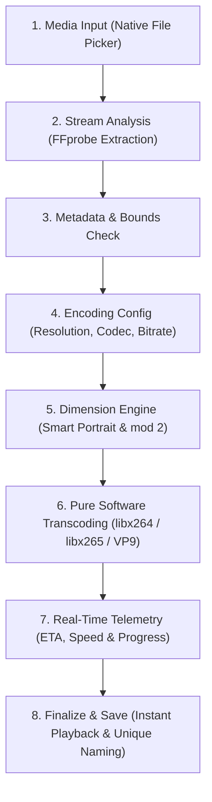

# Phantek Video Toolkit

<p align="center">
  
</p>

<div align="center">
  
  
  
  
</div>

<br/>

**Phantek Video Toolkit** is an advanced, privacy-first, on-device video compression and resolution scaling application built with Flutter and powered by FFmpeg. It is designed to intelligently compress massively oversized videos (4K/2K) into lightweight, highly optimized standard formats (1080p, 720p, etc.) entirely on your local device—no internet required.

---

## 🌟 Key Features

### 🎬 Intelligent Downscaling & Codec Support
- **Resolution Downgrading:** Easily shrink 4K or 2K videos down to 1080p, 720p, 480p, 360p, or 240p. Prevents accidental upscaling of low-res videos.
- **Smart Portrait Detection:** Automatically detects portrait/vertical videos (via rotation metadata) and adjusts target scaling dynamically (e.g., outputs `1080x1920` instead of `1920x1080`), ensuring aspect ratio and orientation are 100% preserved.
- **Advanced Video Codecs:** 
  - **H.264 / AVC:** Universal compatibility across all players and devices.
  - **H.265 / HEVC:** High compression (up to 50% smaller sizes). Automatically injects the Apple/Android compatibility `-tag:v hvc1` specifically for MP4/MOV formats.
  - **VP9:** Extreme compression quality strictly locked to WebM and MKV to prevent Android gallery playback errors.
- **Target Container Formats:** Full support for MP4, MKV, MOV, and WebM encoding.

### ⚡ High-Stability Pure Software Transcoding
- **Full Multi-Threaded CPU Optimization:** Powered by highly reliable, multi-threaded pure software encoders (`libx264`, `libx265`, `libvpx-vp9`) optimized for ARM architectures with user-configurable thread counts and CPU speed presets.
- **Flawless Universal Stability:** Completely eliminates vendor-fragmented hardware encoder incompatibilities across diverse Android chips (MediaTek, Qualcomm, Exynos, Unisoc) to ensure 100% crash-free exports with pristine video fidelity.
- **Auto-Collision File Numbering:** If a video with the same output name already exists in the destination folder, the app automatically appends an incremental number (e.g. `video4k-1080p-2.mp4`), preventing accidental overwrites.

### 📊 Real-Time Telemetry & UX
- **Live Processing Dashboard:** Shows precise ETA, real-time FPS speed, estimated final file size, and percent progression.
- **Wakelock & Background Persistence:** Powered by `flutter_foreground_task`, transcoding can securely continue even when the phone display turns off or minimizes to the background.
- **Multi-Language Support (6 Languages):** Seamlessly switch between Bahasa Indonesia, English, 日本語, 简体中文, 繁體中文, and 한국어.
- **Modern Adaptive UI:** Deep AMOLED Dark, Standard Dark, and Bright Light themes with fixed bounds and perfect ripple splash handling.

---

## 🛠️ Architecture & FFmpeg Pipeline



### 🔄 Pipeline Stages Breakdown

| Stage | Process | Key Responsibility |
| :---: | :--- | :--- |
| **01** | **Media Input** | Streams selected video from device storage via native Android SAF without memory overhead. |
| **02** | **FFprobe Probe** | Extracts metadata: container format, stream specs, rotation angle, framerate, and audio channels. |
| **03** | **Validation** | Determines eligible downscale targets (e.g. 4K &rarr; 1080p, 720p) and prevents accidental upscaling. |
| **04** | **Configuration** | Configures user-selected codec (H.264, H.265, VP9), container, and CRF or target bitrate. |
| **05** | **Dimension Engine** | Automatically flips width &times; height for portrait videos and enforces strict `mod 2` alignment. |
| **06** | **Transcoding** | Employs multi-threaded pure software encoding (`libx264`/`libx265`/`VP9`) for rock-solid stability. |
| **07** | **Live Telemetry** | Calculates real-time elapsed duration, remaining ETA, processing FPS, and live file size. |
| **08** | **Finalization** | Saves output to device Movies folder with automatic collision numbering (e.g. `-2`, `-3`), cleans cache, and provides instant playback. |

### FFmpeg Command Logic

The app strictly optimizes FFmpeg arguments for mobile hardware:
- **Scaling:** Uses `-vf "scale=<W>:<H>:flags=lanczos,format=yuv420p"` enforcing `mod 2` scaling for strict hardware decoding compatibility.
- **VP9 Optimization:** Uses `-deadline good -cpu-used 4 -row-mt 1` to achieve up to 50x faster VP9 encoding speeds compared to default exhaustive single-thread settings.
- **Faststart:** Applies `-movflags +faststart` to MP4 and MOV files for zero-buffering instant web streaming.

---

## 📦 Building the APK (Automated & Optimized)

> [!TIP]  
> Phantek Video Toolkit relies heavily on the `ffmpeg_kit_flutter_new` architecture. To keep the app sizes ultra-compact, we exclusively build and release **Split ABI APKs** for **ARM 32-bit (`armeabi-v7a`)** and **ARM 64-bit (`arm64-v8a`)**. We have entirely removed the bulky "Universal Fat APK" from the build pipeline.

### Method 1: Local Build
```bash
# Build architecture-specific, lightweight APKs:
flutter build apk --release --split-per-abi --target-platform android-arm,android-arm64
```
Outputs are routed to `build/app/outputs/flutter-apk/`.

### Method 2: GitHub Actions CI/CD
This repository is configured with a robust `.github/workflows/build-apk.yml`.
- **Automated Version Tagging:** The workflow automatically reads `pubspec.yaml` (e.g. `1.0.8+8`) and renames the output APKs (e.g., `Phantek-Video-Toolkit-arm64-v8a-v1.0.8.apk`), completely eliminating manual renaming.
- **Triggering Releases:** Simply push a new tag (`git tag v1.0.8 && git push origin v1.0.8`), or run the workflow manually with the "Publish build directly to GitHub Releases" option, and GitHub Actions will cleanly compile the split APKs and publish them instantly to your GitHub Releases page!

---

## 📖 License

This project is licensed under the terms of the GNU General Public License v3.0 (GPLv3) to comply with the bundled `ffmpeg_kit_flutter_new` package and `libx264` codec requirements.
